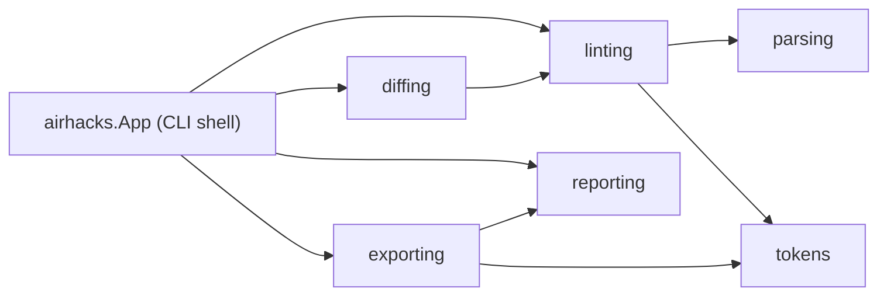

# zdmd

## About

A zero-dependency Java 25 CLI application, built and packaged with [zb](https://github.com/AdamBien/zb). Cloned from the [bce.design](https://bce.design) / [airails.dev](https://airails.dev) `java-cli-app` template.

**Why it exists:** zdmd lints, diffs, and exports [DESIGN.md](https://github.com/google-labs-code/design.md) design-token files without a JavaScript toolchain — a single executable JAR replaces node_modules for agents and developers working with design systems on the JVM. Only web-standard export formats are supported (CSS custom properties, W3C DTCG); Tailwind is intentionally out of scope.

<!-- sbce:generated:start -->
**Charter**: zdmd lints, diffs, and exports DESIGN.md design tokens as a zero-dependency Java CLI.

**Vision**: Design tokens verified and exported anywhere Java runs, with zero dependencies.

**Business components** (specs live in each BC's `package-info.java`):

| BC | Responsibility |
|---|---|
| [`parsing`](src/main/java/airhacks/zdmd/parsing/package-info.java) | Extracts YAML design-token blocks and document structure from DESIGN.md markdown. |
| [`tokens`](src/main/java/airhacks/zdmd/tokens/package-info.java) | Resolves raw parsed values into a typed design system: colors, dimensions, typography, components, and chained token references. |
| [`linting`](src/main/java/airhacks/zdmd/linting/package-info.java) | Lints a DESIGN.md document: parses it, resolves the token model, and runs the default rule set into a findings report. |
| [`diffing`](src/main/java/airhacks/zdmd/diffing/package-info.java) | Compares two lint reports: token-level changes per section and finding-count regressions. |
| [`exporting`](src/main/java/airhacks/zdmd/exporting/package-info.java) | Exports a resolved design system to web-standard formats: CSS custom properties and W3C Design Tokens (DTCG) JSON. |
| [`reporting`](src/main/java/airhacks/zdmd/reporting/package-info.java) | Renders report structures as machine-readable JSON and human-readable markdown. |


<!-- sbce:generated:end -->

## Conventions

- reads a DESIGN.md file argument or stdin (`-`), writes results to stdout, errors to stderr
- exit codes: `lint` 1 on errors, `diff` 1 on regression, 2 on unreadable input, 0 otherwise; a successful `export` exits 0 regardless of lint findings

## Usage

```
zdmd lint <file> [--format json|md]
zdmd diff <before> <after> [--format json|md]
zdmd export <file> --format <css-vars|dtcg> [--prefix <prefix>]
```

## YAML subset

The built-in parser covers what DESIGN.md token files use: nested block mappings and sequences, quoted and plain scalars, flow collections on a single line, literal/folded block scalars, and comments. Anchors, aliases, tags, and multi-document streams are rejected with a recoverable lint warning.

## Prerequisites

Java 25+, [zb](https://github.com/AdamBien/zb)

## Build & run

```
zb
java -jar zbo/zdmd.jar
```

Tests run automatically as the zb post-build hook ([zunit](https://airails.dev)).

## [/sbce](https://sbce.space) Quickstart

Spec-driven BCE 👉 [sbce.space](https://sbce.space): one capability spec ≡ one business component. The spec lives in the BC's `package-info.java` and is the boundary contract; a green test run is the only definition of done. The `/sbce` skill and its companions are installed from 👉 [airails.dev](https://airails.dev).

Example — a "time in business hubs" TZ utility:

```
/sbce new "show the current time in business hubs"  # intent-level (PM/BA or dev): proposes the BC carving, confirm first
/sbce new hubtime                                   # structure-level (dev): the BC is already decided — authors the spec, scaffolds boundary/control/entity
/sbce apply hubtime                                 # converge: close the spec-vs-code gap until the test loop is green
```

Bare `/sbce new` (no argument) bootstraps from the `## About` prose above — it is the inception seed a PM/BA can fill in.
